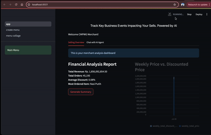
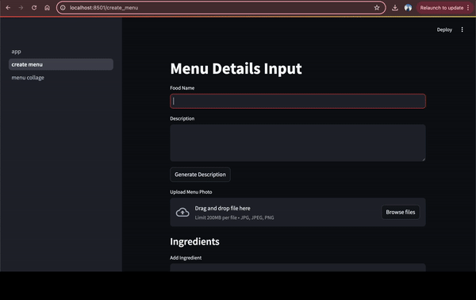
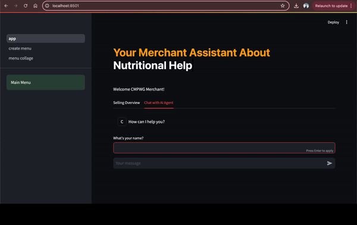
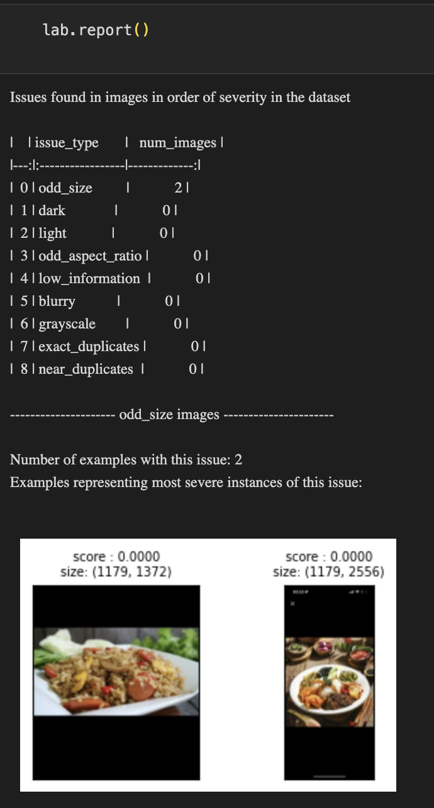

# CMPWG Hackjakarta 2024 Hackathon Project

Merchant Apps Powered with Cohere Command R+, Streamlit, Langchain, Langchain Experimental, Tavily to futurize Financial, Menu building and Inventory management for Merchant using Tools Capable LLM Agent.

## About the Project

Enable Finance Analysis Bot that is capable of Internet Search and Executing Tools to generate Financial Report so the Merchant could have its own Data Analyst, Enable QoL enhancement on Menu creation for the Merchant, Food Image Beautifier, Caption Generation, Automated tagging with RAG, Nutritional Approximation Model by Ingredients Listing, Supply Manager to Balance Order, Forecasted Order and Supplies available.

## Getting Started

To get started with our project, please follow these steps:

1. Clone this repository to your local machine.
2. Navigate to the project directory: `/Users/sanggusti/Study/hackathon/cmpwg_hackjakarta/`.
3. Install any necessary dependencies. I've prepared `pyproject.toml` so you could just `poetry install` or using `requirements.txt` with `pip install -r requirements.txt`.
4. Add `.env` file with content of `COHERE_API_KEY` and `TAVILY_API_KEY`.
5. Explore the project files and documentation to understand the structure and functionality.

## Demo

1. Generate Report based on Selling, Sentiment and Batched Pipeline-like Data

2. Menu Input, Generate Caption, Tagging and Nutritional Value generation for Merchant

3. Financial Agent that are able to use Tools and validate the result and able to internet search

4. Image Enhancer with Diffusion

## Contact

If you have any questions or suggestions regarding our project, please feel free to reach out to us. You can contact us via email in my bio.

Thank you for your interest in our CMPWG Hackjakarta 2024 Hackathon Project!
